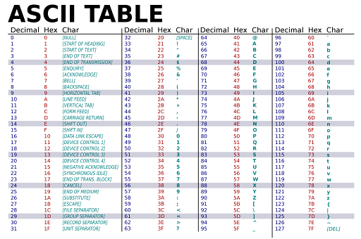

template: quiz.tex
title: Data Representation
date: Feb 1, 2027
---

1. Convert the unsigned binary integer `0b00011101` to decimal.
2. Convert the unsigned binary integer `0b00011101` to hexadecimal.
3. Convert the decimal number -22 to 8-bit two's complement binary.
4. Convert the fixed point binary number 0b0100.1100 to decimal.
5. Subtract `0b01010001 - 0b01101111`. These are two's complement binary numbers.
6. Multiply `0b00001001 $\times$ 0b00001011`. These are unsigned binary numbers.
7. Write the string "Um Ya Ya!" as a sequence of ASCII values. An ASCII table is included at the end of this test.

$$$
\standardsfooter
$$$

