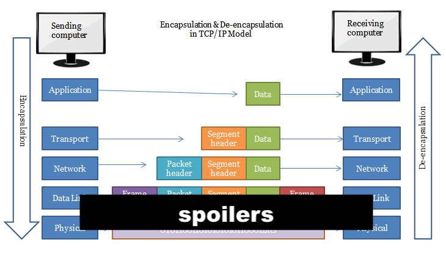

beamer: true
---

# Networking

### What is a Computer Network?

A network is a group of interconnected devices exchanging data. Examples:

- LAN (Local Area Network) - home network with desktops, wired laptops, printer
- WLAN (Wireless Local Area Network) - same, but wifi instead of ethernet cords
- PAN (Personal Area Network) - smartphone, smartwatch, bluetooth accessories
- CAN (Campus Area Network) - computers, phones, servers (eg csgit), etc
- WAN (Wide Area Network) - the internet! Many devices over huge distances

### How Are Networks Connected?
There are a few different ways for devices to communicate:

- Ethernet: voltage in metal wires
- Wifi, bluetooth: electromagnetic radiation (aka radio waves)
- Fiber: Lasers through glass

### Getting Plugged In

Each device talks to the network using a **NIC** (Network Interface Card):

- Not a literal card these days
- Keeps track of connections over wifi, ethernet, etc
- Incoming and outgoing traffic
- Translates between CPU (64+ lanes) and network

### TCP/IP Model

We talk about networking in terms of layers:

- Application Layer - typing `google.com` into Firefox
- Transport Layer - chopping data into segments
- Internet Layer - how many routers fit together to make a network
- Link Layer - getting from one device to the next

### Data Encapsulation

## Application Layer

### Client-Server Model

Data doesn't move on its own:

- Clients issue **requests**
- Servers listen and send **responses**

% server is ready to respond at all times

### Client-Server Model

Clients initiate network connections:
- Your phone
- Your laptop
- ATMs
- Your smart TV

Servers listen and respond:
- Websites
- App backends
- Databases
- Minecraft server

### Client And Server

Can one device be both a client and a server?

If so, can it perform both roles at the same time?

### Client-Server Model

Yes!

- When you type `ping google.com` on your Raspberry Pi to check the internet connection, the Pi is acting as a client
- When you type `ssh kiwi@raspberrypi.local` on your laptop, your Pi is acting as a server

### Domain Name System (DNS)

- Computers use numbers, not words
- Humans can't remember `142.250.190.46`
- We use DNS to bridge the gap
- When you ask for `google.com`, your computer uses DNS to look up the corresponding IP address
- We'll talk more about IP addresses later (internet layer)

### DNS Can Fail!

- Your computer does not know the layout of the whole internet
- DNS lookups are distributed across the internet
- If the DNS server is down, you won't get a response
- Websites may be "up" but inaccessible by name
- This happens every few years!

% The Dyn Attack (2016): DDoS attack hit Dyn, a major DNS provider. Twitter, Spotify, Reddit, and Netflix went dark
% The Facebook/Meta Outage (2021): configuration error removed FB from DNS. Internal systems worked, but no external access
% Akamai Bug (2021): infra bug caused a global DNS disruption affecting airlines, banks
% AWS "Cascading" DNS Failure (2021): AWS bug broke their internal DNS. Disrupted sites hosted on AWS (snapshat, disnet+, venmo)

### Distributed Denial of Service (DDoS) Attacks

% in fact, one of the ways DNS can fail is if the DNS server is attacked!

- A server (DNS or otherwise) is just a computer
- It can handle a handful of tasks at a time
- What happens if we send a million requests to the same server at once?

### Load Balancing

Google gets millions of requests all the time. Why does it not crash?

- The address `google.com` points to a **load balancer**
- Specialized server that does not process any data
- It just forwards requests to other servers

### Hyper Text Transfer Protocol (HTTP)

HTTP is the set of rules for how a browser asks for a webpage.
- Request types: `GET`, `PUT`, `POST`, `DELETE`
- Status code: 200 (normal), 30x (redirect), 40x (client error), 50x (server error)

### HTTP

- You can also attach data to an HTTP request!
- A `GET` request often does not include any data. Just asking for website contents
- A `POST` request could be sending an email. Includes email contents, metadata, auth, etc

### HTTPS

- S for "secure"
- Same rules as HTTP but the data is encrypted
- There are ways for attackers to access your data on the network (more on this later)
- If your data is encrypted, it will be gibberish to them

### Summary

- Human types in a URL
- Computer uses DNS to look up the corresponding IP address
- Send a HTTP request: IP address, type (eg `PUT`), data
- Get a HTTP response: IP address, status (eg `404`), data
- Use HTTPS to encrypt data before sending it

### Exercise

TODO: this

## Transport Layer

### Segmentation and Reassembly

- TCP chops data into **segments** before sending
- Each segment has a header including a sequence ID
- Recipient NIC/OS uses the header to reassemble the data
- Why do you suppose we do this?

% may be multiple apps using the NIC at the same time. port

### Why Segmentize?

- The internet can't handle one giant 5GB file at once
- Resiliency. Eggs in multiple baskets
- Easier for your NIC (network card) to take turns

% don't want all our eggs in one basket

### Multiple Applications

- Your computer might be running Spotify, Zoom, and Chrome at the same time
- Data for each app is getting chopped up into segments
- How do we keep track of what goes where?

### Ports

- Each application "listens" on a certain port
- Ports are assigned by the OS
- SSH server always listens on port 22, HTTPS server always listens on port 443, etc
- Every request has a return address + port for the response

### What happens if a segment gets lost along the way?

- We can ask the other machine to re-send the missing data
- Should we do so? Or just move on without it?

### TCP vs UDP

We choose the protocol based on the use case.

- TCP (Transmission Control Protocol). Delivery is guaranteed. Lost packets are re-sent. Web browsing, email, file transfers
- UDP (User Datagram Protocol). Faster but not guaranteed. Lost packets are gone. Gaming, video calls, streaming

### The Three-Way Handshake

How does TCP ensure a reliable connection?

1. Client: Hey my name is Charles (syn), can you synchronize with me?
2. Server: Hi Charles (ack), my name is Telemachus (syn)
3. Client: Hi Telemachus (ack)

### SYN Flooding

What happens if an attacker sends thousands of handshake requests to the same server, but leaves them hanging without the final acknowledge? 

### Summary

- Requests get broken down into segments for transmission
- Segments can be reassembled using header data: port, sequence ID
- TCP: slower, guaranteed delivery
- UDP: faster, best effort

### Exercise

TODO: this

## Internet Layer

### Routing Segments

- We have segments: data, port, seq ID
- We want to send those segments to an IP address (from DNS)
- What does that process look like?
- Wrap the segment in a **packet**

### Remember: Layers of Encapsulation!

### Routing Packets

- Your laptop sends each packet to a **router**, which looks at the destination IP address
- If the address is in the local neighborhood, deliver it
- Otherwise, use a routing table to figure out which direction to send it
- Different packets may take different paths, then get reassembled later

### Routing Packets

Packets may take different paths. What happens if they get stuck in a loop?

% header also includes a "timer". Drops by 1 every time the packet hits a router. If the timer runs out, the packet is deleted

### BGP Hijacking

- Routing tables are computed based on data from ISPs (called Border Gateway Protocol)
- An attacker can affect routing by compromising or impersonating an ISP
- They can then observe or manipulate data as it passes through

### IP Addresses

- What does my IP address actually look like?
- Ostensibly it's just four 8-bit numbers separated by periods
- How many possible IP addresses are there? How many devices are there?

% IPv4 exhaustion

### IPv4 Exhaustion

- There are about 4 billion possible IPv4 addresses
- There are more than 4 billion network devices
- Eventually we'll switch to IPv6 (128 bits)
- In the meantime we use **public** and **private** IP addresses

### Public and Private IP Addresses

- *Public* IP is the address of your network (eg St Olaf College)
- Public IP address is (mostly) constant to play nice with DNS
- *Private* IP if the address within that network (eg your laptop)
- Private IP addresses can change all the time
- A few IP address patterns are reserved for private (eg `192.168.x.x`, `172.16.x.x`) 

### Public and Private IP Addresses

Network Address Translation (NAT):
- When you send a request to Google, the packet includes your private IP address for the response
- The router at the edge of the network switches it to use the public IP address instead

Port Address Translation (PAT):
- Multiple machines on the same public IP address
- Some may be using the same ports!
- The router switches your private port to a unique public port

% in both cases, the router keeps a table so it can swap back to deliver the response appropriately

### Layer Violation!

- In principle, a router is just moving packets around
- NAT/PAT means it is reading and manipulating packet content
- You can't trust intermediate machines not to read your data
- If you want privacy, you have to encrypt your data!

% also: digging deeper is more CPU intensive

% ### Man in the Middle

% Bad actors can intercept and manipulate unencrypted data without your knowledge:

% - Unsecured wifi network controlled by a bad actor
% - DNS server controlled by a bad actor, redirects traffic
% - Malware installed via social engineering (eg posing as a VPN or security certificate)

% compromised wifi is man in the middle
% malware and DNS aren't really
% might be leaning too hard into security

### Summary

- Data segments are wrapped in packets which contain the destination IP address
- Routers pass packets along until they get to that address
- IPv4 has limited addresses, so we use public + private addresses
- Public/private swap is handled at the edge of the network
- IPv6 replaces public + private, isn't widely used yet

### Exercises

TODO: this

## Link Layer

### MAC Addresses

- Every NIC (network card) has a unique ID burned into it at the factory
- This is how data is ultimately delivered
- Important because local IP addresses are transient

### Frames

- Remember: a packet contains the destination IP address
- But how does data get from one router to the next along the way?
- Wrap the packet in a **frame**
- Frame contains the MAC address of the next device
- Frame also contains a checksum

### Frames

### Wrap Unwrap Wrap Unwrap

- The frame contains the MAC address of the *next* device
- Data may pass through dozens of routers along the way
- Each router must unwrap the frame, look at the IP address, figure out the next step, and rewrap it
- Your computer attaches your MAC address to each outbound frame, but that MAC address doesn't leave your local network

### Address Resolution Protocol (ARP)

- How does a router know the MAC addresses of its neighbors?
- It watches traffic and keeps a table
- For unknown addresses, it broadcasts a frame to everyone and waits for the response
- A NIC (in theory) ignores any frame not addressed to its MAC address

### MAC Attacks

Attackers can trick a router into sending them someone else's data:

- MAC Flooding - fill the router's table with fake addresses so it broadcasts everything to everyone
- ARP Spoofing - pretend to be the router so all traffic passes through the attacker's machine

Encryption ensures that ill-gotten data is not legible

### Exercises

TODO: this

## Performance \& Security

### Metrics of Network Performance

**Bandwidth** is the maximum rate at which data can be transmitted over a network.
**Throughput** is the actual amount of data successfully transmitted over the network in a given time period.
- Low throughput is perceived as buffering or slow downloads.
- Limit on volume of data transmitted.
**Latency** is the time between a packet being sent, and a response being received.
- High latency is perceived as slow or delayed actions (e.g. lag in video games).
- Limit on speed of data transmitted.
**Packet Loss** is the percent of packets that fail to reach their destination.
- High packet loss is perceived as choppy audio/video, generally slower performance due to retransmission.
- Inconsistency in timing of data received.

### Attacking the Server

These happen as data travels across the web.

- Man-in-the-Middle (MitM): This is the "big picture" version of ARP spoofing. The attacker sits between the Client and Server, reading (and sometimes changing) the data.
- The Big One You’re Missing: IP Spoofing. Faking the "Source IP" on a packet to bypass firewalls or pretend to be a trusted server.

### Network Security

- Eavesdropping is intercepting network traffic to steal sensitive information.
- While packets traverse a network, they can be captured by unauthorized parties. This is called packet sniffing.
- In a Man-in-the-Middle (MitM) attack, an attacker positions themselves between communicating parties. This allows them to intercept, and potentially alter, messages.

### Network Security

### Encryption

Encryption is a powerful tool against eavesdropping. Encryption scrambles data being sent, so that (in theory) only the intended recipient can unscramble it to read the message. For example, HTTPS encrypts communications.
Really cool cryptography: public-key encryption, RSA

### Exercise

TODO: this

## Network Hardware

We have just focused on routers. There are other types of hardware too:

- firewall. not hardware, but often looks like it in network diagrams. program that filters packets based on IP address, port, etc
- Fiber optic
- Wires
- coaxial cable (the same kind used for cable TV)
- Wifi, bluetooth
- Repeater - makes a signal stronger in case of long wires
- Modem - translates ISP signal (eg fiber, cable) to ethernet
- Switch - delivers frames to the appropriate MAC address
- Bridge - switch with only 2 ports
- WAP - like a switch but for wifi. white boxes on the ceiling
- Hub - like a switch but not smart. sends everything to everyone
- Gateway - a plastic box containing router, modem, switch

